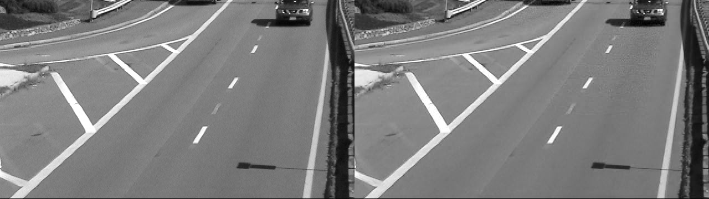

# Fast Algorithm for the 3-D DCT

2D Discrete Cosine Transform (2D-DCT) is well know and wide used algorithm for imgage compression. All logic behind jpeg compression is based on DCT. We can also implement DCT on 3D matrix such as videos. In that project, we reimplemented some part of the paper which was on fast versions of 3D DCT and its inverse method named 3D IDCT [1]. To show the accuracy of the code, we did test both standart and fast method of 3d DCT on random generated 32x32x32 matrix. To see that test please run following script;
```matlab
> main_test
```
Then the result will be something like that
```matlab
Time conpumstion for 32x32x32 matrix DCT with ordinary alg :81.6705 sec
Time conpumstion for 32x32x32 matrix DCT with fast alg :1.87874 sec
difference between fast and ordinary ones output: 9.58882e-13
```
As you can see fast method outperformed ordinary method on that test. Also the sum of absolute differences result of ordinary and fast method results has no meaningful differences as you can see it is 9.58882e-13.

We just did small example of that method on video compression demo. We read so called video which consist of 8 gray scale frames. Then we performed fast 3d dct, quatization, zigzag ordering and finally run length encoding to get the compression version of the 8 frame video. Then we compare compression rate of raw images and compression one. To show how we decode that compression data, we decode encoded data stream, then applied inverse zigzag ordering, followed by inverse quantization and finally inverse 3d DCT. To see that demo please run following script.
```matlab
> main_videocompression
```
We selected %90 jpeg quality quantization matrix on our test. As a result we took 10.1707 compression rate on our demo, which means compression data is less than %10 of the raw data. You can see original input at the left and decoding of compressed images on the right. Althoug there are some differences, compression rate is enough sufficient. 




#H3 Reference
[1] Boussakta, Said, and Hamoud O. Alshibami. "Fast algorithm for the 3-D DCT-II." IEEE Transactions on Signal Processing 52.4 (2004): 992-1001.
